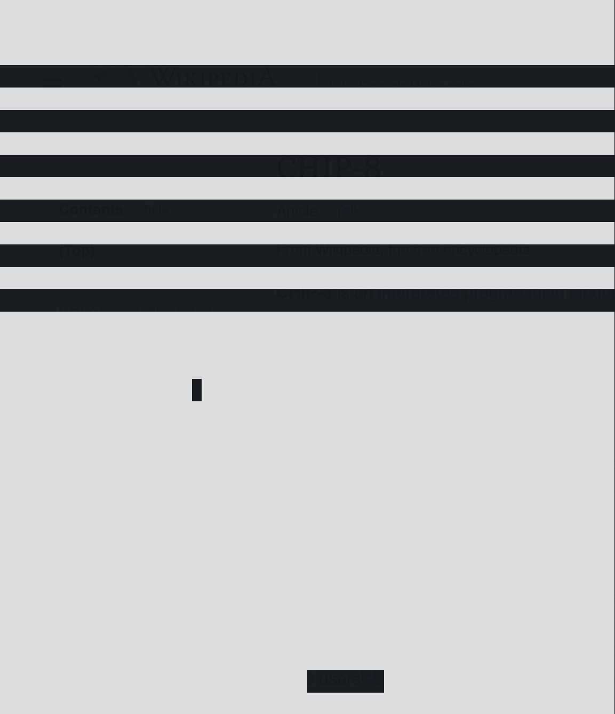

# CHIP-8 Emulator in C#

> [!WARNING]  
> This emulator may not fully support games designed for later CHIP-8 variants like CHIP-48 or SCHIP.

## About the Project

An implementation of the classic 1977 CHIP-8 interpreted programming language, written in C#. This emulator allows you to run CHIP-8 programs directly in a terminal window.

## Motivation

The goal of this project is to explore object-oriented programming concepts, particularly by avoiding large `switch` blocks in favor of polymorphism and other clean coding practices.  
Note: This approach prioritizes design clarity over performance optimization, obviously.

## Dependencies

- [.NET 8](https://dotnet.microsoft.com/)

## Quick Start

```console
dotnet run
```
The application scans your project directory for .ch8 programs and then prompts you to select one from a list.

</br>
<p align=center>
  
</p>

## References 

- https://en.wikipedia.org/wiki/CHIP-8
